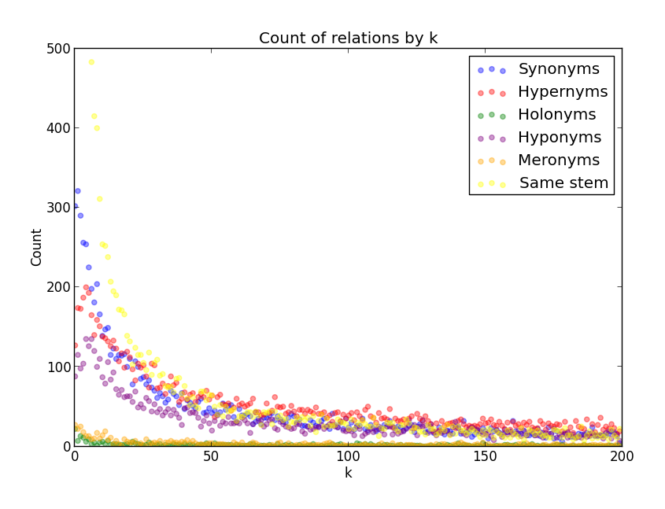

###An empirical study of semantic similarity in WordNet and Word2Vec
#####Abram Handler | Master's Thesis: University of New Orleans, Fall 2014

####Project
Word2Vec is a new unsupervised system for determining the semantic distance between words. For instance, after learning from billions of web pages, Word2Vec reports that the words Chinese river are semantically close to the word Yangtze. Such results have attracted lots of recent attention: over 100 researchers have cited Word2Vec since its publication in 2013. Yet certain aspects of the system’s output are poorly understood. 

In particular:

1. Word2Vec does not label particular semantic relationships between words – like the synonomy between cold and chilly or the meronomy between wheel and car. Instead, it assigns a number between 0 and 1, indicating the semantic distance between two words. As Word2Vec's creator's note: “there can be many different types of similarities.” [2] This opens an unknon question: what sorts of semantic similarities does Word2Vec uncover?

2. Word2Vec can generate ranked lists showing which words are closer are further way in a semantic model. For example, Word2Vec says that grand-master is 3rd from the word chess, while Muay Thai kickboxing is 997th. What is the probability that two words that are k-apart in Word2Vec stand in some formal specific semantic relationship?

This study seeks to answer such questions by comparing Word2Vec’s output with WordNet – a large, human-curated “lexical database” [3] and the most-frequently cited “lexiographic resource” [4] in English.

####Results

Pick a word from the Reuters corpus. Get the 200 closest words in Word2Vec. How are these 200 words semantically related to the original word?

####Files

`main.sh` Primary driver for the application. Use ./main.sh to run the experiment and generate results

`experiment.py` Runs the experiment

`wordnetter.py` Handles the logic for determining the relations

`wordnetchecker.py` Finds the average numbers of each relation in WordNet

`process_results.sh` Calculates totals used to show final results

`scatterplot_maker.py` Creates a scatter plot showing the probability of a certain relation.

`type_counter.sh` Counts the type of each relation. Part of process_results.sh

`total_count_chart_maker.py` and `total_count_chart_maker_adjusted.py` Make the scatter plots

`tester.py` Some unit tests

`averagejacard.py` Finds the average Jacard distance for each type of relation

####Dependencies

* **NLTK 3.0.0**
* **Gensim 0.10.2**
* **numpy 1.9.0**
* **Word vectors from Google news corpus** [downloadable here](https://code.google.com/p/word2vec/).

